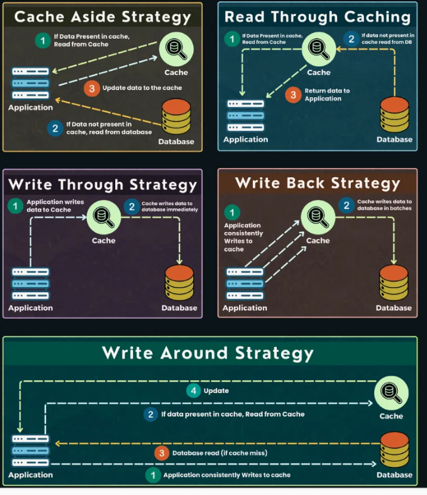

# 10 Trade Offs Every System Design 

[https://rockybhatia.substack.com/p/10-trade-offs-every-system-design]
## ***Vertical vs Horizontal sclaing - scaling is not just  "MORE servers"***

### **Vertical scaling (scale up)**
Upgrade your machine: more CPU, more RAM, faster disk.

- Simple to implement — just upgrade the box.
- Has physical limits — there’s only so much you can add.
- A single point of failure — still one machine.

Use case: RDBMS, legacy systems, dev environments.

### **Horizontal scaling (scale- out)**
Add more machinea nd distribute the load across them.

- Highly scalable - keep adding servers.
- Fault tolerant - one node fails, others still run.
- Needs more effort - load balancing, sharding, stateless services.

Use case: Web servers, microservices, modern databases.

## ***SQL vs NoSQL - More than just a schema choice***

- SQL databases are traditional, relational, and ACID-compliant systems offering strong consistency but limited horizontal scalability. They are best for structured and transactional data.
  - MySQL, PostgreSQL, Oracle, SQL Server
- NoSQL databases are schema-less or flexible schema, designed for horizontal scalability and distributed data storage. They often sacrifice some consistency for availability and partition tolerance, ideal for big data and real-time applications.
  - MongoDB, Cassandra, Redis, Couchbase
- NewSQL databases aim to combine the best of both worlds: they offer SQL-like relational models and ACID guarantees with the scalable, distributed architecture of NoSQL.
  - Google Spanner, VoltDB, NuoDB 

**Polyglot Persistence** is a strategy where multiple types of databases (SQL, NoSQL, NewSQL) are used together within the same application to leverage their individual strengths for different parts of the system.

Main Reason is that SQL scaling horizonatally is weird or more application load, thats why NewSQL cna be used

NewSQL databases typically use a ***shared-nothing*** architecture, which means each node in the cluster is independent and has its own CPU, memory, and storage. 

In this architecture, the data is partitioned or sharded across these nodes so that each node is responsible for a subset of the data, avoiding contention for shared resources.

Benefits for NewSQL:
- Scalability through horizontal sharding.
- Fault isolation since node failures don’t impact others.
- Strong transactional guarantees even in distributed environments.\
- High performance without bottlenecks from shared storage or memory.

## ***Sync vs Async Processing — Choosing the Right Path***

***When to Use Sync:***
- You need immediate user feedback (e.g., login, payment).
- The operation is quick and deterministic.
- Failure needs to be known immediately (e.g., user authentication).

***When to Use Async:***
- Task takes longer (e.g., video processing, sending emails).
- You want to decouple services (e.g., orders → inventory → shipment).
- You need to absorb spikes in traffic via a queue.

 ***Real-World System Design Implications***:
- Async is harder to debug: logs, retries, dead-letter queues.
- But it's more resilient: failures don't block the whole flow.
- Often, you mix both: sync for core flow, async for side-effects (e.g., sending a notification after purchase).

> Pro Tip:
In interviews, don’t just say “make it async.” 

> Say: “We can process the request synchronously for the user-facing part, and enqueue secondary tasks for async processing—this improves responsiveness while maintaining reliability.”

# ***Batch vs Stream Processing — When Timing is Everything***
## Batch Processing
Data is collected over a period, then processed in chunks.

- Simple, mature, cost-efficient
- Not real-time — delays in insights or actions
- Best for: ETL jobs, reports, ML training, analytics
- Example: Generating daily sales reports, processing logs at midnight.

## Stream Processing
Data is processed in real time (or near real time) as it arrives.

- Low latency, immediate insights
- Operationally complex — needs infra like Kafka, Flink, Spark Streaming
- Best for: Fraud detection, real-time alerts, live metrics, recommender systems
- Example: Showing live stock prices, flagging suspicious login attempts.

## Design Insight
> "Batch is like getting your news from the morning paper.
Stream is like getting breaking updates on your phone."

- Choose batch for stability, throughput, and simplicity
- Choose stream when latency is a feature, not just a metric.
  
## Lambda Architecture Explained
Lambda Architecture is a data-processing framework designed to handle massive quantities of data by combining batch processing and stream processing to achieve a balance between accuracy, latency, and fault tolerance.

### The Three Layers

- Batch Layer (Cold Layer):
  - Stores all incoming raw data as an immutable, append-only dataset.
  - Performs batch processing on the entire data set to produce accurate, comprehensive views.
  - Results are highly accurate but have high latency, as batch jobs can take minutes to hours.

- Speed Layer (Hot Layer):
  - Processes data as it arrives using stream processing for low latency.
  - Provides real-time or near-real-time views of the most recent data.
  - It sacrifices some accuracy and completeness but ensures freshness.

- Serving Layer:
  - Combines outputs from batch and speed layers to serve queries.
  - It merges the accurate batch views with the fresh speed views to provide a comprehensive, up-to-date response.

### Why Use Lambda Architecture?
- Batch processing alone is too slow for real-time insights.
- Stream processing alone might not guarantee accuracy or completeness.
- Lambda architecture uses a hybrid model to get the best of both worlds.

### Key Points for Interviews
- Show understanding that real-world systems often require mixing both batch and stream processing, not just choosing one.
- Explain how the hybrid approach balances data freshness (speed layer) and accuracy (batch layer).
- Mention the importance of the serving layer to combine and query data seamlessly.

>Technologies Often Used
> - Batch Layer: Apache Hadoop, Spark, Snowflake
> - Speed Layer: Apache Kafka, Apache Flink, Apache Storm
> - Serving Layer: Apache Druid, ClickHouse, Cassandra

# ***Read-Through vs Write-Through Caching***
Two caching strategies. Same goal: faster reads. Different philosophies.

## Read-Through Caching
The application queries the cache first.
If there's a cache miss, the app fetches from the database, returns the value to the client, and writes the result into the cache.

- Simple and reactive: only fetch what’s needed
- Works well for read-heavy systems
- Cache might be stale unless eviction policies (e.g., TTL) are well-tuned
- Use case: Product detail pages, user profiles, dashboards.
- Think of it like: “Don’t preload — just fetch and save what I ask for.”

## Write-Through Caching
Every write operation updates both the database and the cache simultaneously.
(First write to cache and then cache rights to the DB)
- Cache is always in sync with DB — minimal chance of stale data
- Adds write latency, and if the cache layer fails, writes may fail too
- Ideal for read-freshness critical systems like real-time pricing, stock levels
- Use case: e-commerce inventory, price updates, real-time financial data.
- Think of it like: “If it changes, update everyone at once.”

- negates the benfits of caching, write latency is high

🧠 Interview Insight:
“I’d prefer read-through for high-traffic pages where occasional staleness is fine. For sensitive or fast-changing data, write-through gives strong consistency at the cost of write latency.”

# ***REST vs GraphQL — The API Interface War***

For simple CRUD services, REST is perfect. But when frontend demands are dynamic or nested, GraphQL provides flexibility — as long as I layer it with cost controls and caching

## REST (Representational State Transfer)
- Works with multiple fixed endpoints like /users, /posts/{id}
- Data is served in predefined shapes — often overfetching or underfetching
- Mature, well-supported, and easy to cache
- Use case: CRUD apps, admin panels, traditional backends

> “You get what the server decides. Simple and structured.”

## GraphQL
- Single endpoint (/graphql) where clients query exactly what they need
- Reduces overfetching, ideal for complex UIs and mobile apps
- Requires schema management, query complexity control, and validation layers
- Use case: Dynamic UIs, mobile-first apps, microservices gateway

> “You ask for exactly what you want. Powerful, but needs guardrails.”

# ***Strong vs Eventual Consistency — What Do You Trust Your Data To Do?***
Consistency is not binary — it’s a spectrum.
Understanding where your system lives on this spectrum determines user experience vs resilience trade-offs.

## Strong Consistency
- Every read after a write returns the most recent value — across all replicas.
- Guarantees correctness — no surprises
- Higher latency, less tolerant to failures
- Ideal for critical systems: financial transactions, user authentication
- Example: RDBMS (Postgres, MySQL), Spanner (globally distributed but consistent)

>“If you see it, it’s true — everywhere, every time.”

## Eventual Consistency
- Writes are propagated asynchronously — replicas converge over time.
- Fast and highly available under partition
- Reads may return stale data temporarily
- Perfect for non-critical paths: social feeds, analytics, likes
- Example: DynamoDB, Cassandra, S3

>“Everyone sees the truth — eventually.”

# ***Stateful vs Stateless — The Hidden Backbone of Scalability***

## Stateful Systems
- State is stored in the server’s memory or local storage—user sessions, progress, or connection state.
- Useful for real-time apps (e.g., video calls, multiplayer games)
- Harder to scale — state must be replicated or “sticky sessions” used
- Failover is complex — a crash can mean data loss or re-login
- Example: WebSocket servers, FTP sessions, legacy banking apps

## Stateless Systems
- Each request is independent and self-contained. The server doesn’t remember past requests.
- Easy to scale — any instance can serve any request
- Simplifies load balancing, retries, and deployments
- You must store state externally (e.g., Redis, DB, tokens)
- Example: REST APIs, serverless functions, most microservices

# ***Normalization vs Denormalization — Structure vs Speed***
This trade-off sits at the core of database design. It’s not just about storing data—it’s about how you’ll use it at scale.

## Normalization (3NF and beyond)
- Data is organized into multiple related tables to eliminate redundancy.
- Saves space, avoids data duplication
- Maintains consistency through relationships
- Requires joins — which can become expensive at scale

Use case: Financial systems, CRMs, admin panels where integrity matters most

## Denormalization
- Data is intentionally duplicated and flattened for faster access.
- Improves read performance (fewer joins)
- Ideal for serving high-traffic APIs and feed systems
- Data inconsistencies and complex updates

Use case: News feeds, dashboards, product listings

## Design Trade-Off
>"Normalize when you're writing a lot and need accuracy.
Denormalize when you're reading a lot and need speed."

Use normalization during writes and internal processing.
Use denormalization for read-optimized views or materialized reports.

## Pro Tip:
In interviews or production systems, don’t pick one blindly.
Say:

>“We’ll normalize our core models, but denormalize for the read path—using caching or materialized views.”

This shows real-world maturity.

# ***Consistency vs Availability — The Heart of Distributed Systems***
This is the classic CAP theorem tension: you can't have it all in a partitioned network.
You must choose what to sacrifice temporarily when things go wrong.

## Consistency
- Every node returns the same most recent data, no matter which one you hit.
- Trustworthy: No stale reads
- Slower or unavailable during network splits
- Best when accuracy > uptime (e.g., banking, financial ledgers)
- Example: Relational databases, distributed locks (e.g., Zookeeper)

>“I’d rather reject your request than serve wrong data.”

## Availability
- Every request gets a response, even if it’s not the latest version.
- Always responsive — great for uptime SLAs
- Can return stale or eventually consistent data
- Best when speed and uptime > strict accuracy (e.g., social media feeds, shopping carts)
- Example: DynamoDB, Cassandra

>“I’ll give you an answer, even if it’s not the freshest one.”

## Real-World Trade-Off
>“Would you rather be 100% right... or 99.9% available?”
Systems like Amazon choose availability — and fix inconsistencies later (eventual consistency).

## Interview Insight:
>Say:
“In a network partition, I’d prefer consistency for money transfer services, and availability for user comments or likes. I’ll design my system based on this choice.”

# ***Strong vs Eventual Consistency — What Do You Trust Your Data To Do?***
Consistency is not binary — it’s a spectrum.
Understanding where your system lives on this spectrum determines user experience vs resilience trade-offs.

## Strong Consistency
- Every read after a write returns the most recent value — across all replicas.
- Guarantees correctness — no surprises
- Higher latency, less tolerant to failures
- Ideal for critical systems: financial transactions, user authentication
- Example: RDBMS (Postgres, MySQL), Spanner (globally distributed but consistent)

>“If you see it, it’s true — everywhere, every time.”

## Eventual Consistency
- Writes are propagated asynchronously — replicas converge over time.
- Fast and highly available under partition
- Reads may return stale data temporarily
- Perfect for non-critical paths: social feeds, analytics, likes
- Example: DynamoDB, Cassandra, S3

>“Everyone sees the truth — eventually.”